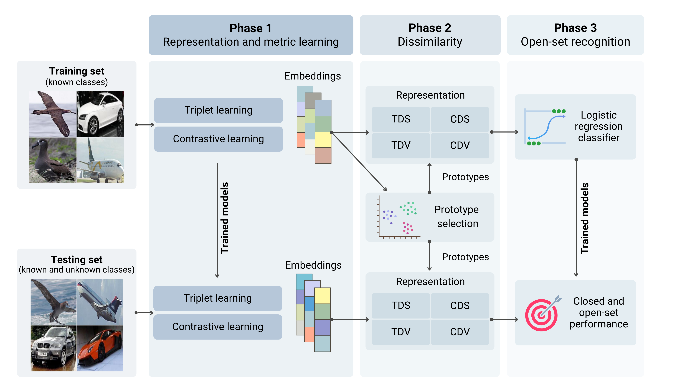

# Improving Open Set Recognition with Dissimilarity-Based Metric Learning

Open set recognition addresses the problem of classifying instances where the model must not only recognize and classify examples from known classes, but also handle unknown classes not present in the training set. Unlike traditional classifiers, which assume only samples from known classes appear during testing, OSR must detect and manage instances beyond the scope of the training classes. In this paper, we propose a novel approach that combines dissimilarity-based representation with task-specific metric learning in an end-to-end framework. Dissimilarity representation is an alternative to the traditional feature space representation that represents samples based on their differences. By adaptively learning a dissimilarity function specific to the task, our method improves the ability to distinguish between known and unknown classes. We evaluate the proposed method using two popular representation learning techniques, triplet loss and contrastive loss, across multiple experiments: standard OSR benchmarks (CIFAR-10 and SVHN), class-scaling scenarios (DTD and FMD), and the Semantic Shift Benchmark; our proposal consistently outperforms baseline models in both closed-set accuracy and open-set detection.

## Method

This proposal presents a novel approach for open-set recognition using dissimilarity and metric learning. The method leverages dissimilarity, which captures structural differences between samples, as an alternative to traditional feature spaces. By applying deep learning for complex feature extraction, the approach maps raw data to a feature space where similar instances are grouped and distinct instances are separated. The method integrates metric learning to estimate a task-specific dissimilarity function in an end-to-end manner. The process is divided into three phases: 1) representation and metric learning using triplet and contrastive learning to generate embeddings and dissimilarity functions, 2) mapping these embeddings into a dissimilarity space or vector representation, and 3) training a classifier for both closed- and open-set recognition. The proposed strategy aims to improve generalization, especially when distinguishing known and unknown classes in open-set recognition scenarios.



## Results

Results on the CIFAR-10 and SVHN datasets show that the proposed methods, Triplet Dissimilarity Space (TDS), Triplet Dissimilarity Vector (TDV), Contrastive Dissimilarity Space (CDS), and Contrastive Dissimilarity Vector (CDV), outperform the baseline models in both closed-set accuracy and AUROC for open-set detection. The contrastive methods, particularly CDV, achieved the highest performance across multiple datasets, with CDV improving closed-set accuracy and AUROC significantly over the baseline. Similarly, in the class scaling benchmark, the proposed methods maintained strong performance as the proportion of unseen classes increased. The methods also demonstrated competitive performance on the Semantic Shift Benchmark, with CDV achieving competitive results across the CUB, Aircraft, and Cars datasets, surpassing baseline models in both closed-set accuracy and open-set metrics like AUROC and OpenAUC, particularly for harder unknown classes.

## Conclusion

In this paper, we proposed a novel dissimilarity-based framework for open-set recognition that unifies representation and metric learning to derive a task-specific dissimilarity function; by mapping data into a space of pairwise differences, the method more effectively separates known from unknown classes, and our experiments confirm that the contrastive dissimilarity variants (CDS and CDV) consistently surpass strong baselines across diverse datasets and openness levels. Building on previous research, we also observed a clear positive correlation between closed-set accuracy and open-set performance, suggesting that advances in standard classification accuracy directly translate into improved rejection of unseen categories. Finally, we note an important open challenge: metrics optimized only on seen classes do not always extrapolate gracefully to unseen semantics, and this shortcoming grows with semantic shift; developing approaches that mitigate this limitation remains a promising direction for future research.

## Citation

```
@article{Teixeira2025OSRDissimilarity,
  title = {Improving Open Set Recognition with Dissimilarity-Based Metric Learning},
  journal = {Knowledge-Based Systems},
  pages = {114108},
  year = {2025},
  issn = {0950-7051},
  doi = {https://doi.org/10.1016/j.knosys.2025.114108},
  url = {https://www.sciencedirect.com/science/article/pii/S0950705125011530},
  author = {Lucas O. Teixeira and Diego Bertolini and Luiz S. Oliveira and George D.C. Cavalcanti and Yandre M.G. Costa}
}
```